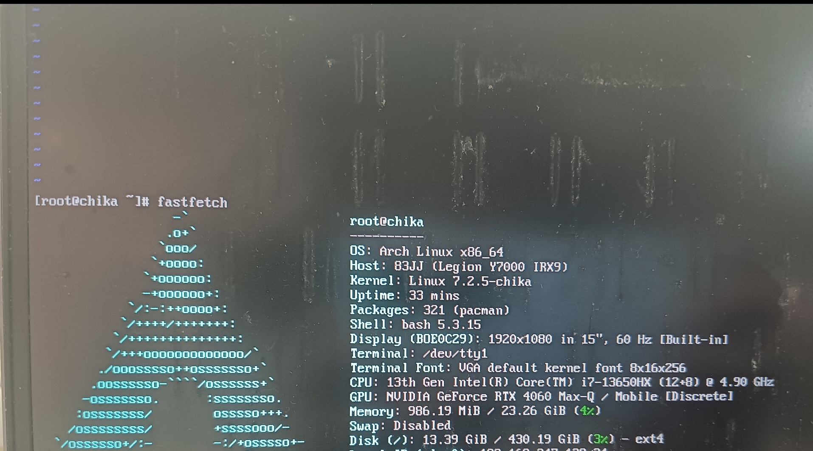

::: 2026-04-26

Whenever I sit before VS Code and the terminal, a quiet illusion settles in—that I can create an entire world. The cursor blinks in VS Code, and bash waits for a command. In that instant, the world is compressed into pure input and output. You type npm init, and the project gains a skeleton. Write a function, and you have rules. git push, and your ideas are launched onto someone else's screen. In this moment, the world no longer demands that I perform smoothness, no longer forces me to guess in silence, to maneuver through pleasantries. When the keys fall, thought is translated directly into reality; will needs no detour, desire needs no compromise. There are no spectators, no judge's bench—only the screen glowing dispassionately, like an honest mirror reflecting exactly what I want to build.
Sometimes I feel that code is not a tool but a clearer language. It is no good at consoling, no good at concealing; it can even be harsh—miss a single symbol and it refuses you without mercy. And yet, precisely because of this, it is fascinating. It requires no guessing, no ingratiation; as long as the conditions are met, the result appears. In this world, such plainspoken things are rare. So I sit before the screen, the scrolling logs like flowing water beside a pond, washing away the noise outside. Now the world seems to stand still, and you finally understand: this solitude is not absence, but freedom.

That calm, eternally blinking cursor is like a spark at the bottom of a deep well. It is not an invitation, not a prod, but more like a patience—a patience more thorough than any human being's. The sounds of the outside world are cut off by a firewall, not a physical one, but a barrier that naturally arises the moment you fix your gaze on the scrolling logs. The rumble of the subway, the buzz of the phone, the expectations of others—all lose their power to penetrate before the flowing text of stdout.

You type ls, and it honestly lists the present state, no embellishment, no hidden corners. You say cd .., take a step back, and the world really steps back. Such causality is so rare, rare to the point of luxury. No one hides emotion in words, no gaze needs deciphering, no silence needs to be guessed. Between you and the machine there is only a contract so concise as to be almost cruel: if correct, it runs; if wrong, it throws an error.

And so chaos begins to be ordered, vagueness begins to be named, and wishes begin to turn into something executable. The outside world is still clamoring, but before this glowing screen, the clamor temporarily loses its power. What you hear is only the faint echo of a command landing. It is not victory, nor escape—just a rare quiet.
:::

::: 2026-05-06

Happy birthday to me!
:::

::: 2026-05-17

I accidentally discovered that I had written a static website generator.
:::

::: 2026-05-17

happy coding daliy life.
:::

::: 2026-05-25

Everyday, I always read papers and write code. Although I enjoy them, I have some hobbies such as tinkering with my linux desktop(Uh...it still ugly), adding new features in my blog, taking a photograph and so on. There are so many novels I want to read. But I always fall asleep after reading less than two pages. Oh well...things will be better if you don't think more.
:::

::: 2026-06-28

so abstract. btw. :-(
:::

::: 2026-06-29

so real.

:::

::: 2026-07-02

code is my blood, math is my soul, and logic is my breath.
:::

::: 2026-07-03

suki suki suki suki suki suki

:::

::: 2026-07-07

suki suki suki

:::

::: 2026-07-12

Severely dependent on caffeine
:::

::: 2026-09-18

**Always check the path before and verify the presence of other mount of points before executing any ```rm -rf *```.**

Recently, I gave gentoo linux a try; the installation process was actually quite arduous--I spend almost a whole day to configuring it. I am performing the installation on an archlinux host. The inital preparations are simple.
```bash
sudo mkdir -p /mnt/yuki
sudo mount /dev/nvme0n1p7 /mnt/yuki
sudo mkdir -p /mnt/yuki/proc
sudo mount --types proc /proc /mnt/yuki/proc
sudo mkdir -p /mnt/yuki/dev
sudo mount --rbind /dev /mnt/yuki/dev && sudo mount --make-rslave /mnt/yuki/dev
sudo mkdir -p /mnt/yuki/sys 
sudo mount --rbind /sys /mnt/yuki/sys && sudo mount --make-rslave /mnt/yuki/sys
sudo mkdir -p /mnt/yuki/run 
sudo mount --bind /run /mnt/yuki/run && sudo mount --make-slave /mnt/yuki/run
sudo cp /etc/resolv.conf /mnt/yuki/etc/
```

The preliminary preparations are now compleRte.  eady to ```chroot``` the new system.
```bash
sudo chroot /mnt/yuki /bin/bash
```
The chroot environment inherits the host's network settings;  
```bash
export http_proxy=http://127.0.0.1:7890
export https_proxy=http://127.0.0.1:7890
export all_proxy=http://127.0.0.1:7890
```
Now we will pull the linux source code.
```bash
curl -L -o /usr/src/ https://www.kernel.org/pub/linux/kernel/v7.x/linux-7.2.5.tar.xz
cd /usr/src
zcat /proc/.config.gz > .config
./scripts/config --disable SYSTEM_TRUSTED_KEYS
./scripts/config --disable SYSTEM_REVOCATION_KEYS
./scripts/config --disable DEBUG_INFO_BTF
./scripts/config --set-str LOCALVERSION "-chika"
./scripts/config --disable LOCALVERSION_AUTO
./scripts/config --enable  EFI_STUB
./scripts/config --enable  DRM_SIMPLEDRM
./scripts/config --enable  SYSFB_SIMPLEFB
./scripts/config --disable CMDLINE_OVERRIDE
./scripts/config --enable  MODULE_SIG
./scripts/config --disable MODULE_SIG_FORCE
make olddefconfig
```
make sure config is correct. Given the dependencies, who knows that what happens after ```make olddefconfig``` ?
```bash
for s in EFI_STUB DRM_SIMPLEDRM SYSFB_SIMPLEFB BLK_DEV_NVME EXT4_FS \
         BTRFS_FS DRM_NOUVEAU MODULE_SIG SYSTEM_TRUSTED_KEYS; do
  printf '%-24s %s\n' "$s" "$(./scripts/config --state $s)"
done
```
write  ```/etc/kernel/cmdline```
```bash
root=UUID=<uuid> rw
```
```bash
make "-j$(nproc)"
```
Everything is proceeding so smoothly. I installed sucessfully.  However, the number of gentoo mirror sites is pitifully small. I didn't notice the community announcement my IP got banned because I synchronized too many times. 
After a few twists and truns, I back archlinux. 
arch is best, pacman is best, AUR is best. ~~(KomariChika is best)~~
This time, I customized my kernel—a process that took nearly 19 hours, primarily spent on kernel tuning. I chose niri as my desktop environment; I feel it suits me better, as it has a superior approach to tiling. 

I probably won't be sprucing up my desktop for a while; the renderer project has already dragged on for a week, and since I have a lot of things I want to do lately, I really need to catch up on progress.
:::

::: 2026-09-18


:::
